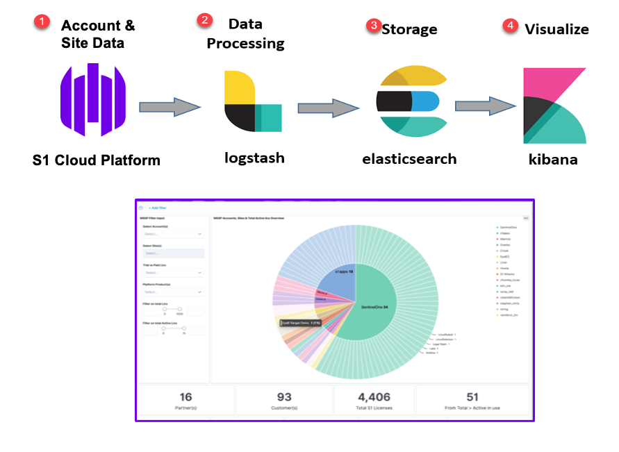

# SentinelOne to ELK Reporter Tool

SentinelOne API data collection to report in ELK elastick stack. 

### Script1 : "s1_reporter_datacollector.sh"
Bash script to allow automated collection of SentinelOne platform data (Accounts & Sites) and import this into ELK stack for reporting use.

Run following bash command to start data collection script '**sudo ./s1_reporter_datacollector.sh**'

Important: ** Before executing this script to collect and Process SentinelOne Platform Data,  
make certain you have an active ELK stack up & running or, complete Script2 (s1_reporter_elk_install.sh) prior of starting.

### Script2 (optional): "s1_reporter_elk_install.sh"
Bash script to allow automated installation of ElasticSearc, Logstash & Kibana (ELK stack) on Linux OS.
Additionally completing configuration of Logstash service for use with SentinelOne MSP reporter Tool.

Run following bash command to start installation script '**sudo ./s1_reporter_elk_install.sh**'

Important: *** This script requires the installation user to have passwordless sudo access on system ***

### Script3 (Optional) : "s1_reporter_json-csv.sh"
This script can be used to convert SentinelOne Account & Site specific Platform data (.JSON) into CSV format for 3rd party reporting use.
Does not require an active ELK Stack service up & running.

Run following bash command to start data export script '**sudo ./s1_reporter_json-csv.sh**'

Please see Data process flow below :

